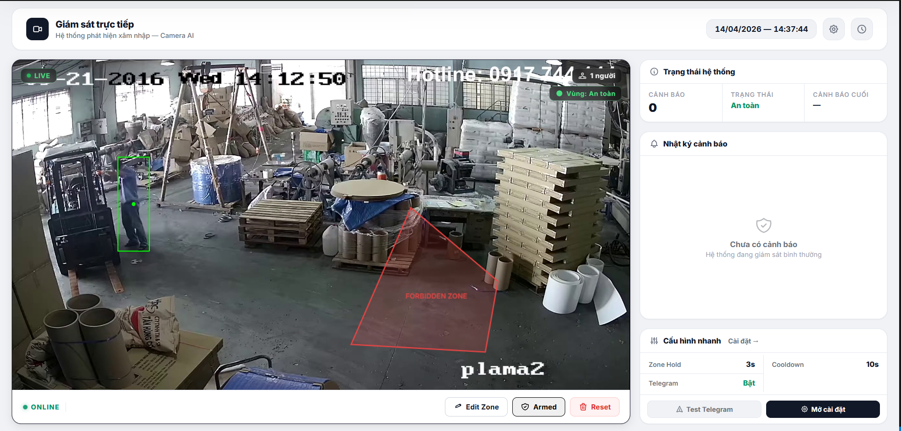
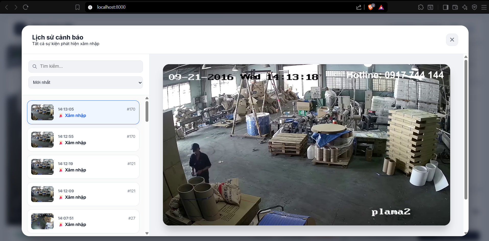
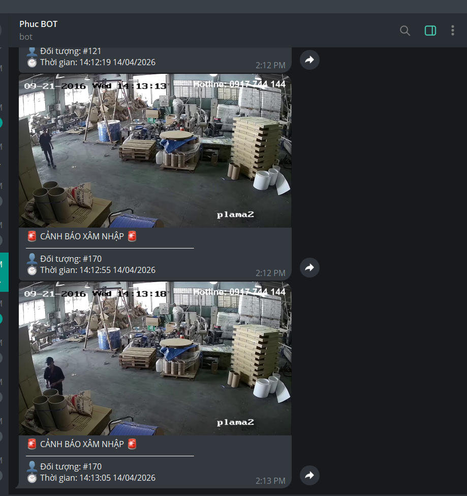
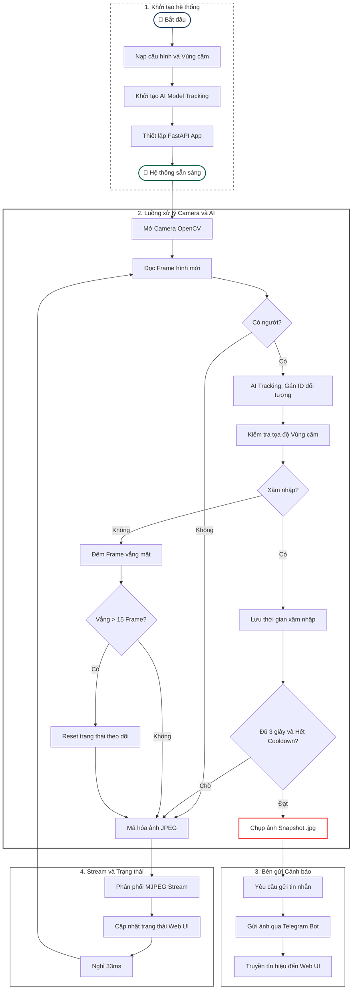

# CamAI — Hệ Thống Giám Sát Camera Thông Minh

> **Stack:** FastAPI · YOLOv8 · OpenCV · Telegram Bot · SSE

## 📸 Ảnh Demo Giao Diện & Tính Năng

Đây là một số hình ảnh thực tế của hệ thống khi hoạt động:

**1. Giao diện Giám sát Trực tiếp (Live Dashboard)**


**2. Giao diện Lịch sử Cảnh báo**


**3. Thông báo tự động gửi về Telegram**


---

## 📁 Cấu Trúc File

```
phuc/
├── main.py            # Core: camera loop, YOLO, state, dispatch
├── router.py          # API endpoints (FastAPI Router)
├── telegram_utils.py  # Gửi ảnh/text qua Telegram
├── config.py          # Hằng số cấu hình toàn cục
├── settings.json      # Config động (lưu khi user chỉnh qua UI)
└── zone.json          # Tọa độ vùng cấm (lưu persistent)
```

---

## 🔄 Luồng Xử Lý Backend Chi Tiết

### Bước 0 — Khởi Động (`main.py` + `router.py`)

```
Chạy main.py
  → load config.py          (hằng số: camera, model, Telegram token...)
  → load settings.json      (config động: hold_secs, cooldown...)
  → load zone.json          (tọa độ polygon vùng cấm)
  → YOLO("yolov8n.pt")      (nạp model AI vào RAM)
  → FastAPI app             (mount router + static files)
  → uvicorn listen :8000
```

---

### Bước 1 — Đọc Frame từ Camera

**Hàm:** `video_generator()` — `main.py` dòng 136

```python
cap = cv.VideoCapture(CAMERA_SOURCE, cv.CAP_DSHOW)
cap.set(CAP_PROP_FRAME_WIDTH,  640)
cap.set(CAP_PROP_FRAME_HEIGHT, 480)
cap.set(CAP_PROP_FPS, 30)

ok, frame = cap.read()   # đọc 1 frame BGR
```

- Camera mở **1 lần duy nhất**, vòng lặp `while True` đọc liên tục.
- Nếu `ok = False` → `sleep(0.05)` rồi thử lại (không crash).
- Target FPS = 30, code tự tính `sleep` bù thời gian xử lý.

---

### Bước 2 — YOLO Tracking (Multi-Object)

**Hàm:** `video_generator()` — `main.py` dòng 163–170

```python
with model_lock:   # thread-safe (tránh race condition)
    results = model.track(
        frame,
        persist=True,    # giữ track_id ổn định qua nhiều frame
        verbose=False,
        classes=PERSON_CLS   # chỉ detect class "person"
    )

boxes = results[0].boxes.xyxy   # tọa độ [x1,y1,x2,y2]
ids   = results[0].boxes.id     # track_id duy nhất mỗi người
confs = results[0].boxes.conf   # confidence score
```

**`persist=True`** là chìa khóa: YOLOv8 dùng **ByteTrack** bên trong —
mỗi người được gán `track_id` cố định, dù bị che khuất vài frame vẫn giữ nguyên ID.

---

### Bước 3 — Kiểm Tra Vùng Cấm (Forbidden Zone)

**Hàm:** `video_generator()` — `main.py` dòng 182–215

Scale tọa độ zone (frontend 640×480) về kích thước thực của frame:

```python
sx, sy = sw / FRAME_W, sh / FRAME_H
scaled_zone = np.array([[int(p[0]*sx), int(p[1]*sy)] for p in zone_points])
```

Kiểm tra người có đứng **trong polygon** không:

```python
center_pt = ((x1+x2)/2, (y1+y2)/2)   # điểm giữa bbox
foot_pt   = ((x1+x2)/2, y2)           # điểm chân người

inside = (
    cv.pointPolygonTest(scaled_zone, center_pt, False) >= 0
    or
    cv.pointPolygonTest(scaled_zone, foot_pt, False) >= 0
)
```

> **Tại sao check cả 2 điểm?** Người đứng ở rìa zone:
> center có thể ngoài zone nhưng chân đã bước vào → vẫn bị tính là xâm nhập.

---

### Bước 4 — Đếm Frame & Quyết Định Gửi Cảnh Báo

**Hàm:** `video_generator()` — `main.py` dòng 189–209

```
Người bước vào zone (inside = True)
    │
    ├── [Lần đầu] → lưu zone_enter_times[tid] = now
    │
    ├── duration = now - zone_enter_times[tid]
    │
    ├── duration >= hold_secs (mặc định 3s)?
    │       Và cooldown hết (now - last_alert >= cooldown)?
    │           │
    │           └─► GỬI CẢNH BÁO ✅
    │                 zone_last_alert[tid] = now  (reset cooldown)
    │
    └── Chưa đủ thời gian → bỏ qua, frame tiếp theo tiếp tục đếm
```

Logic **cooldown per-track**: mỗi `track_id` có cooldown riêng —
người A gửi alert không ảnh hưởng cooldown của người B.

```python
last_tid_alert = state["zone_last_alert"].get(tid, 0)

if duration >= hold and now - last_tid_alert >= cooldown:
    state["zone_last_alert"][tid] = now
    dispatch_alert(path, tid, is_intrusion=True)
```

---

### Bước 5 — Xử Lý Khi Người Ra Ngoài Zone

**Hàm:** `video_generator()` — `main.py` dòng 211–223

```python
# inside = False
state["zone_missed"][tid] += 1

if state["zone_missed"][tid] > 15:   # ~0.5 giây (15 frames / 30fps)
    state["zone_enter_times"].pop(tid, None)   # reset đồng hồ
    state["zone_alerted"].discard(tid)
```

> **Tolerance 15 frame** tránh false reset: người bị che khuất tạm thời (tay vẫy, vật cản)
> không bị mất track và phải đếm lại từ đầu.

---

### Bước 6 — Dispatch Alert (Thread riêng, Non-blocking)

**Hàm:** `dispatch_alert()` — `main.py` dòng 84–115

```python
def dispatch_alert(img_path, track_id, is_intrusion):
    def _run():
        # 1. Gửi Telegram (blocking I/O — chạy trong thread)
        telegram_utils.send_formatted_intrusion_alert(...)

        # 2. Broadcast SSE event → Web UI cập nhật real-time
        data = json.dumps({...})
        loop.create_task(_broadcast(data))

    threading.Thread(target=_run, daemon=True).start()
    #  ↑ Non-blocking! Camera loop tiếp tục chạy ngay lập tức
```

**Tại sao dùng Thread riêng?**
- `requests.post()` Telegram có thể mất **2–5 giây**.
- Nếu gọi thẳng trong camera loop → drop frame → giật lag.
- Thread riêng → camera loop **không bị block** → stream mượt.

---

### Bước 7 — Gửi Telegram

**Module:** `telegram_utils.py`

```python
def send_formatted_intrusion_alert(photo_path, token, chat_id, track_id, is_intrusion, hold_secs):
    caption = "🚨 CẢNH BÁO XÂM NHẬP 🚨\n" + "—"*30
            + f"\n👤 Đối tượng: #{track_id}"
            + f"\n⏱ Thời gian: {time.strftime(...)}"

    send_alert_photo(photo_path, token, chat_id, caption)
    #  → POST https://api.telegram.org/bot{token}/sendPhoto
```

---

### Bước 8 — Stream Video & SSE ra Web

| Kênh | Endpoint | Dữ liệu |
|---|---|---|
| **Video stream** | `GET /api/stream` | MJPEG multipart (frame JPEG liên tục) |
| **SSE alerts** | `GET /api/alerts` | JSON push khi có cảnh báo |
| **SSE status** | `GET /api/alerts` | JSON `{type:"status", count, intrusion}` |

**SSE hoạt động thế nào?**

```python
# router.py — sse_alerts()
async def generator():
    q = asyncio.Queue()
    main.sse_clients.append(q)   # đăng ký nhận broadcast
    while not await request.is_disconnected():
        yield f"data: {await q.get()}\n\n"   # chặn đợi event

# main.py — _broadcast()
async def _broadcast(payload):
    for q in sse_clients:
        await q.put(payload)   # đẩy vào queue của từng client
```

---

## 🗺️ Lưu Đồ Hoạt Động



---

## ❓ 5 Câu Hỏi Tự Luyện

### Q1. YOLO biết đây vẫn là "người cũ" qua các frame nhờ cơ chế gì?

**Trả lời:** Nhờ `persist=True` trong `model.track()`.

YOLOv8 dùng thuật toán **ByteTrack** bên trong. ByteTrack so sánh vị trí và kích thước bbox giữa các frame bằng **IoU (Intersection over Union)** để ghép người cũ với detection mới → gán cùng `track_id`.

**Hàm trong code:**
```python
# main.py dòng 164
results = model.track(frame, persist=True, verbose=False, classes=PERSON_CLS)
ids = results[0].boxes.id.int().cpu().tolist()   # → [1, 3, 5, ...]
```

---

### Q2. Tại sao phải check cả `center_pt` lẫn `foot_pt` khi kiểm tra vùng cấm?

**Trả lời:** Vì `center_pt` (giữa bbox) có thể vẫn nằm **ngoài** zone trong khi người đã bước chân vào.

Ví dụ: người đứng ở rìa zone → nửa người ngoài, nửa chân trong → chỉ check center sẽ bỏ sót.
`foot_pt = (x_center, y2)` — điểm chân — đại diện cho vị trí thực tế trên sàn.

**Hàm trong code:**
```python
# main.py dòng 184–187
center_pt = (float((x1+x2)/2), float((y1+y2)/2))
foot_pt   = (float((x1+x2)/2), float(y2))
inside = (
    cv.pointPolygonTest(scaled_zone, center_pt, False) >= 0
    or cv.pointPolygonTest(scaled_zone, foot_pt, False) >= 0
)
```

---

### Q3. Tại sao gửi Telegram trong Thread riêng thay vì gọi thẳng trong camera loop?

**Trả lời:** Gọi `requests.post()` là **blocking I/O** — có thể mất 2–5 giây chờ server Telegram phản hồi.

Nếu gọi thẳng trong `video_generator()`:
- Camera **dừng đọc frame** trong lúc chờ → stream bị lag/giật
- Có thể miss người đang di chuyển

Dùng `threading.Thread(target=_run, daemon=True).start()` → camera loop **không bị block**, tiếp tục 30fps bình thường.

**Hàm trong code:**
```python
# main.py dòng 115
threading.Thread(target=_run, daemon=True).start()

# Trong _run():
telegram_utils.send_formatted_intrusion_alert(...)   # blocking - OK vì đang ở thread riêng
loop.create_task(_broadcast(data))                   # push SSE
```

---

### Q4. Tolerance 15 frame khi người rời khỏi zone để làm gì?

**Trả lời:** Tránh **false reset** do che khuất tạm thời.

Thực tế camera: người giơ tay → bbox bị che → YOLO miss 1–3 frame → nếu reset ngay thì đồng hồ về 0, người phải đứng thêm `hold_secs` nữa mới bị cảnh báo → hệ thống unreliable.

15 frame ≈ 0.5 giây ở 30fps — đủ để YOLO "tìm lại" người bị che khuất tạm thời.

**Hàm trong code:**
```python
# main.py dòng 212–215
state["zone_missed"][tid] = state["zone_missed"].get(tid, 0) + 1
if state["zone_missed"][tid] > 15:
    state["zone_enter_times"].pop(tid, None)   # mới thực sự reset
    state["zone_alerted"].discard(tid)
```

---

### Q5. SSE hoạt động thế nào để Web nhận cảnh báo real-time mà không cần polling?

**Trả lời:** SSE (Server-Sent Events) là kết nối HTTP **một chiều, giữ mở**. Client kết nối 1 lần, server gửi data bất kỳ lúc nào mà không cần client hỏi.

**Cơ chế:**
1. Browser mở `EventSource("/api/alerts")` → kết nối HTTP giữ mở
2. `sse_alerts()` tạo `asyncio.Queue` → đăng ký vào `sse_clients[]`
3. Khi camera loop gọi `dispatch_status()` hoặc `dispatch_alert()` → `_broadcast()` đẩy data vào **tất cả queues**
4. Generator `yield f"data: {payload}\n\n"` → HTTP response tự đẩy đến browser

**Hàm trong code:**
```python
# router.py dòng 197–208
async def sse_alerts(request: Request):
    async def generator():
        q = asyncio.Queue()
        main.sse_clients.append(q)    # đăng ký nhận
        while not await request.is_disconnected():
            yield f"data: {await q.get()}\n\n"   # block đợi, push khi có

# main.py dòng 74–80
async def _broadcast(payload: str):
    for q in sse_clients:
        await q.put(payload)   # đẩy đến tất cả clients đang kết nối
```

---

## 📊 Tóm Tắt State Machine — Vòng Đời 1 Track ID

```
track_id xuất hiện
    │
    ├─► [outside zone] → không làm gì
    │
    └─► [inside zone]
            │
            ├── frame 1: zone_enter_times[tid] = T0
            │            zone_missed[tid] = 0
            │
            ├── frame N: duration = Tn - T0
            │            duration < hold_secs → chờ
            │
            ├── duration >= hold_secs
            │   cooldown hết → DISPATCH ALERT 🚨
            │   zone_last_alert[tid] = now
            │
            ├── [rời zone tạm thời]
            │   zone_missed++ → nếu < 15: giữ nguyên timer
            │                 → nếu >= 15: reset enter_time
            │
            └── [biến mất khỏi frame]
                    zone_enter_times.pop(tid)
                    zone_alerted.discard(tid)
                    zone_missed.pop(tid)
                    zone_last_alert.pop(tid)
```
>>>>>>> 07a431c (oke)
>>>>>>> 1502591 (Initial commit for VisionAlert)
>>>>>>> 07a431c (oke)
